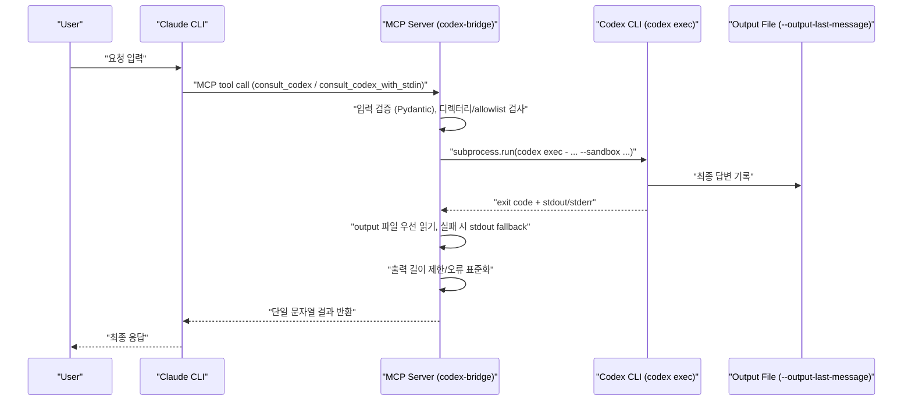

# Codex MCP Bridge Lite

[](https://pypi.org/project/codex-mcp-bridge/)
[](https://pypi.org/project/codex-mcp-bridge/)
[](https://opensource.org/licenses/MIT)

A local stdio MCP server that exposes two tools for Claude CLI and executes `codex exec` non-interactively.

- `consult_codex`
- `consult_codex_with_stdin`

Placeholder convention used in this README:
- `<project-root>` = your local clone path for this repository (for example, `~/workspace/codex-mcp-bridge`).

## Features

- Uses `codex exec -` (prompt via stdin) in non-interactive mode.
- Captures final output via `--output-last-message` file first.
- Default sandbox is `read-only`.
- Optional directory allowlist via `CODEX_ALLOWED_DIRS`.
- Output truncation via `CODEX_MAX_OUTPUT_CHARS`.
- Concise error handling for missing CLI/auth/timeout/non-zero exits.
- Keeps MCP stdout clean (no debug logging to stdout).

## Requirements

- Python 3.10+
- Codex CLI installed and authenticated (`codex login`)

## Install

### From PyPI (recommended)

```bash
pip install codex-mcp-bridge
```

Or with uv:

```bash
uv pip install codex-mcp-bridge
```

### From source (development)

```bash
cd <project-root>
uv venv
source .venv/bin/activate
uv pip install -e .[dev]
```

## Run (stdio MCP)

After installing from PyPI:

```bash
codex-mcp-bridge
```

Or from source:

```bash
cd <project-root>
uv run codex-mcp-bridge
```

## Claude CLI registration

### After pip install (recommended)

```bash
claude mcp add codex-bridge -- codex-mcp-bridge
```

### From source

```bash
claude mcp add codex-bridge -- uv --directory <project-root> run codex-mcp-bridge
```

### Verify registration

```bash
claude mcp get codex-bridge
```

## Sub-Agent Skills (Slash Commands)

Example skills are provided in `examples/claude-commands/`. These let you delegate tasks to Codex with a single slash command.

### Available skills

#### Full sub-agent mode

| Skill | Description | Sandbox |
|---|---|---|
| `/claude-codex-subagent` | **Comprehensive sub-agent** — auto-selects tool, sandbox, and format based on task. Supports multi-step delegation. | auto |

Usage:
```
/claude-codex-subagent Review src/config.py, fix any issues, then generate tests
/claude-codex-subagent Explain the MCP protocol flow, then add retry logic to runner.py
/claude-codex-subagent What is the best caching strategy for this project?
```

This skill acts as an intelligent orchestrator: it analyzes the task, gathers context, delegates to Codex with the right parameters, validates the result, and applies changes. For complex tasks, it chains multiple Codex calls (analyze → plan → execute → verify).

#### Read-only (analysis, no file changes)

| Skill | Description | Sandbox |
|---|---|---|
| `/codex-review` | Code review — bugs, security, performance | `read-only` |
| `/codex-test` | Generate tests for specified code | `read-only` |
| `/codex-explain` | Explain code logic and design decisions | `read-only` |
| `/codex-ask` | General technical question to Codex | `read-only` |

#### Write-enabled (can modify/create files)

| Skill | Description | Sandbox |
|---|---|---|
| `/codex-fix` | Fix bugs and issues in code | `workspace-write` |
| `/codex-refactor` | Refactor code for readability and structure | `workspace-write` |
| `/codex-generate` | Generate new code/files from description | `workspace-write` |

### Install skills

Copy the example skills to your project's `.claude/commands/` directory:

```bash
# From cloned repo
mkdir -p .claude/commands
cp <project-root>/examples/claude-commands/*.md .claude/commands/

# Or download directly from GitHub
mkdir -p .claude/commands
for cmd in claude-codex-subagent codex-review codex-test codex-explain codex-ask codex-fix codex-refactor codex-generate; do
  curl -sL "https://raw.githubusercontent.com/dante01yoon/codex-mcp-bridge/main/examples/claude-commands/${cmd}.md" -o ".claude/commands/${cmd}.md"
done
```

### Basic usage

```
/codex-review src/server.py
/codex-test src/runner.py
/codex-explain src/config.py
/codex-ask "How does MCP stdio transport work?"
/codex-fix src/runner.py "timeout is not applied when value is 0"
/codex-refactor src/config.py
/codex-generate "Create a health check endpoint that returns server status and uptime"
```

### Workflow examples

#### Workflow 1: Review → Fix

Find issues first, then fix them:

```
User: /codex-review src/runner.py

  → Codex returns: "3 issues found:
     1. [critical] subprocess timeout not handled when value is 0
     2. [warning] stderr truncation may lose important error context
     3. [info] magic number 2000 should be a named constant"

User: /codex-fix src/runner.py "subprocess timeout not handled when value is 0"

  → Codex fixes the issue and applies changes
```

#### Workflow 2: Generate → Test → Review

Build new code and validate it:

```
User: /codex-generate "Add a validate_schema function that checks tool input against JSON Schema"

  → Codex generates src/codex_bridge_mcp/validator.py

User: /codex-test src/codex_bridge_mcp/validator.py

  → Codex generates tests/test_validator.py

User: /codex-review src/codex_bridge_mcp/validator.py

  → Codex reviews the generated code for bugs and improvements
```

#### Workflow 3: Explain → Refactor

Understand before changing:

```
User: /codex-explain src/codex_bridge_mcp/config.py

  → Codex explains: "Settings class loads config with precedence:
     tool input > env var > JSON file > defaults. The _find_config_file
     function searches cwd then ~/.config/codex-bridge/..."

User: /codex-refactor src/codex_bridge_mcp/config.py

  → Codex refactors with understanding of the design intent preserved
```

#### Workflow 4: Ask → Generate

Research then build:

```
User: /codex-ask "What is the best way to implement retry logic for subprocess.run with exponential backoff?"

  → Codex returns explanation with code pattern

User: /codex-generate "Add retry logic with exponential backoff to the run_codex function in runner.py"

  → Codex generates the implementation
```

### Auto-delegation via CLAUDE.md

To make Claude automatically prefer Codex for coding tasks (without explicit slash commands), add the provided snippet to your project's `CLAUDE.md`:

```bash
cat <project-root>/examples/CLAUDE.md.example >> CLAUDE.md
```

This makes Claude delegate code review, test generation, and technical questions to Codex by default. See `examples/CLAUDE.md.example` for the full configuration.

## Default Launcher Command (Recommended)

Use this launcher to make Claude prefer `codex-bridge` automatically for coding tasks, without writing explicit templates each time.

Launcher script:
- `<project-root>/scripts/claude_codex_launcher.sh`

Run:
```bash
<project-root>/scripts/claude_codex_launcher.sh
```

Optional shell alias:
```bash
alias claude-codex='<project-root>/scripts/claude_codex_launcher.sh'
```

Then use:
```bash
claude-codex
```

Audit launcher (verifies whether Codex bridge tools were actually used):
```bash
<project-root>/scripts/claude_codex_audit.sh "Return exactly BRIDGE_OK"
```

Optional audit alias:
```bash
alias claude-codex-audit='<project-root>/scripts/claude_codex_audit.sh'
```

The audit launcher prints:
- `=== Claude Result ===` final answer text
- `tools_used:` all MCP/tool calls observed
- `codex_bridge_used: yes/no` explicit Codex usage signal
- `codex_bridge_tools:` exact codex-bridge tool names used

Why this launcher is useful:
- Consistent behavior: always injects Codex-first guidance via `--append-system-prompt`.
- Less friction: you do not need to paste tool-call templates for every technical query.
- Fewer permission denials: pre-sets `--allowedTools` for both bridge tools.
- Safer defaults: guidance includes `sandbox=read-only` and `timeout=180` as baseline.

Customizing launcher behavior:
```bash
export CLAUDE_CODEX_APPEND_PROMPT='Your custom codex-first instruction'
export CLAUDE_CODEX_ALLOWED_TOOLS='mcp__codex-bridge__consult_codex,mcp__codex-bridge__consult_codex_with_stdin'
```

Korean quick note:
- 이 런처는 Claude 기본 시스템 프롬프트를 제거하지 않고, Codex 우선 지침을 추가(`append`)합니다.
- 따라서 기본 동작은 유지하면서 Codex 도구 호출 확률을 높이는 방식입니다.

## Quick Guide (EN)

1. Install and run:
```bash
pip install codex-mcp-bridge
codex-mcp-bridge
```

Or from source:
```bash
cd <project-root>
uv venv && source .venv/bin/activate
uv pip install -e .[dev]
uv run codex-mcp-bridge
```

2. Register MCP server in Claude CLI:
```bash
# After pip install
claude mcp add codex-bridge -- codex-mcp-bridge

# Or from source
claude mcp add codex-bridge -- uv --directory <project-root> run codex-mcp-bridge
```

3. Verify MCP connection:
```bash
claude mcp get codex-bridge
```

4. Verify end-to-end tool calls through Claude:
```bash
cd ~
claude -p --output-format text --permission-mode dontAsk --allowedTools mcp__codex-bridge__consult_codex -- "Call mcp__codex-bridge__consult_codex with arguments {\"query\":\"Return exactly BRIDGE_OK\",\"directory\":\"<project-root>\",\"format\":\"text\",\"timeout\":180,\"sandbox\":\"read-only\"}. Return only the tool result."
```

```bash
cd ~
claude -p --output-format text --permission-mode dontAsk --allowedTools mcp__codex-bridge__consult_codex_with_stdin -- "Call mcp__codex-bridge__consult_codex_with_stdin with arguments {\"stdin_content\":\"ping\",\"prompt\":\"Return exactly PONG\",\"directory\":\"<project-root>\",\"format\":\"text\",\"timeout\":180,\"sandbox\":\"read-only\"}. Return only the tool result."
```

5. Troubleshooting:
- `tool denied due to permission restrictions`: add `--allowedTools mcp__codex-bridge__consult_codex` or use a permission mode that allows MCP tools.
- `Codex timed out after 90 seconds`: increase tool `timeout` (e.g. `180`) and keep prompts short/explicit.
- `codex CLI not found`: install Codex CLI and check PATH.
- `Codex authentication appears unavailable`: run `codex login`.

## 빠른 가이드 (KR)

1. 설치 및 실행:
```bash
pip install codex-mcp-bridge
codex-mcp-bridge
```

또는 소스에서:
```bash
cd <project-root>
uv venv && source .venv/bin/activate
uv pip install -e .[dev]
uv run codex-mcp-bridge
```

2. Claude CLI에 MCP 서버 등록:
```bash
# pip 설치 후
claude mcp add codex-bridge -- codex-mcp-bridge

# 또는 소스에서
claude mcp add codex-bridge -- uv --directory <project-root> run codex-mcp-bridge
```

3. MCP 연결 상태 확인:
```bash
claude mcp get codex-bridge
```

4. Claude 경유 E2E 도구 호출 검증:
```bash
cd ~
claude -p --output-format text --permission-mode dontAsk --allowedTools mcp__codex-bridge__consult_codex -- "Call mcp__codex-bridge__consult_codex with arguments {\"query\":\"Return exactly BRIDGE_OK\",\"directory\":\"<project-root>\",\"format\":\"text\",\"timeout\":180,\"sandbox\":\"read-only\"}. Return only the tool result."
```

```bash
cd ~
claude -p --output-format text --permission-mode dontAsk --allowedTools mcp__codex-bridge__consult_codex_with_stdin -- "Call mcp__codex-bridge__consult_codex_with_stdin with arguments {\"stdin_content\":\"ping\",\"prompt\":\"Return exactly PONG\",\"directory\":\"<project-root>\",\"format\":\"text\",\"timeout\":180,\"sandbox\":\"read-only\"}. Return only the tool result."
```

5. 문제 해결:
- `permission restrictions`로 도구가 거부되면 `--allowedTools`에 해당 MCP 도구를 명시하거나 MCP 허용 모드로 실행합니다.
- `Codex timed out after 90 seconds`가 발생하면 도구 인자의 `timeout`을 늘리고 요청을 짧고 명확하게 작성합니다.
- `codex CLI not found` 오류는 Codex CLI 설치 또는 PATH 설정 문제입니다.
- 인증 오류가 보이면 `codex login`을 먼저 수행합니다.

## Claude Prompt Templates (EN/KR)

Use these templates when you want Claude to invoke Codex via MCP first.

### Template A: Codex-first simple text result (EN)

```text
Call mcp__codex-bridge__consult_codex with arguments {"query":"<YOUR_TASK>","directory":"<project-root>","format":"text","timeout":180,"sandbox":"read-only"}.
Return only the tool result.
```

Example:

```text
Call mcp__codex-bridge__consult_codex with arguments {"query":"Return exactly BRIDGE_OK","directory":"<project-root>","format":"text","timeout":180,"sandbox":"read-only"}.
Return only the tool result.
```

### 템플릿 A: Codex 우선 단순 텍스트 결과 (KR)

```text
mcp__codex-bridge__consult_codex 도구를 다음 인자로 호출해줘: {"query":"<작업 지시문>","directory":"<project-root>","format":"text","timeout":180,"sandbox":"read-only"}.
그리고 도구 결과만 그대로 반환해줘.
```

예시:

```text
mcp__codex-bridge__consult_codex 도구를 다음 인자로 호출해줘: {"query":"정확히 BRIDGE_OK만 반환해","directory":"<project-root>","format":"text","timeout":180,"sandbox":"read-only"}.
그리고 도구 결과만 그대로 반환해줘.
```

### Template B: Structured JSON result (EN)

```text
Call mcp__codex-bridge__consult_codex with arguments {"query":"<YOUR_TASK: return strict JSON>","directory":"<project-root>","format":"json","timeout":180,"sandbox":"read-only"}.
Return only the tool result without markdown fences.
```

### 템플릿 B: 구조화된 JSON 결과 (KR)

```text
mcp__codex-bridge__consult_codex 도구를 다음 인자로 호출해줘: {"query":"<JSON으로 응답해야 하는 작업>","directory":"<project-root>","format":"json","timeout":180,"sandbox":"read-only"}.
마크다운 코드블록 없이 도구 결과만 반환해줘.
```

### Template C: Large input via stdin block (EN)

```text
Call mcp__codex-bridge__consult_codex_with_stdin with arguments {"stdin_content":"<LARGE_INPUT>","prompt":"<TASK_PROMPT>","directory":"<project-root>","format":"json","timeout":180,"sandbox":"read-only"}.
Return only the tool result.
```

### 템플릿 C: 큰 입력 전달 (KR)

```text
mcp__codex-bridge__consult_codex_with_stdin 도구를 다음 인자로 호출해줘: {"stdin_content":"<큰 입력 데이터>","prompt":"<작업 지시문>","directory":"<project-root>","format":"json","timeout":180,"sandbox":"read-only"}.
그리고 도구 결과만 반환해줘.
```

CLI tip (when using `claude -p`):
- If MCP tool calls are denied, include `--allowedTools mcp__codex-bridge__consult_codex` (or `_with_stdin`).
- If timeout occurs, increase `timeout` in tool arguments (e.g. `180` or `240`).

## How It Works (Claude -> Codex CLI Bridge)



핵심 동작 원리:
- Claude는 오케스트레이터 역할만 하고, 코드 생성/분석 실행은 MCP 도구를 통해 Codex CLI에 위임합니다.
- 브리지는 `codex exec`를 비대화식으로 실행하며, stdout 오염을 막기 위해 프로토콜 통신은 stdout, 디버그/오류는 stderr로 분리합니다.
- Codex 결과는 `--output-last-message` 파일에서 우선 읽고, 파일 읽기 실패 시 캡처된 stdout으로 대체합니다.
- 보안/안정성은 기본 `read-only` sandbox, 디렉터리 allowlist, timeout, stderr 절단, output truncation으로 보장합니다.

## Configuration

Settings can be configured via a **JSON file**, **environment variables**, or both.

Precedence: **tool input > environment variable > config file > default**.

### JSON config file

Place `codex-bridge.json` (or `.codex-bridge.json`) in your project root or `~/.config/codex-bridge/`:

```json
{
  "default_timeout": 180,
  "default_sandbox": "read-only",
  "default_model": null,
  "allowed_dirs": [],
  "max_output_chars": 12000
}
```

An example is provided in `examples/codex-bridge.json`.

### Environment variables

Environment variables override JSON config values:

- `CODEX_DEFAULT_MODEL` (optional)
- `CODEX_DEFAULT_TIMEOUT` (default: `90`)
- `CODEX_DEFAULT_SANDBOX` (default: `read-only`)
- `CODEX_ALLOWED_DIRS` (optional CSV absolute/relative dirs)
- `CODEX_MAX_OUTPUT_CHARS` (default: `12000`)

Environment variables can also be set at MCP registration time:

```bash
claude mcp add -e CODEX_DEFAULT_TIMEOUT=180 codex-bridge -- codex-mcp-bridge
```

## Tool Inputs

### `consult_codex`

- `query` (required)
- `directory` (default `.`)
- `format` (`text | json | code`, default from server `json`)
- `timeout` (seconds, optional)
- `model` (optional)
- `sandbox` (`read-only | workspace-write | danger-full-access`, optional)

### `consult_codex_with_stdin`

- `stdin_content` (required)
- `prompt` (required)
- plus all options from `consult_codex`

## Test

```bash
cd <project-root>
uv run pytest
```

## Smoke / Regression Scripts

```bash
cd <project-root>
./scripts/check_stdout_clean.sh
```

```bash
cd <project-root>
./scripts/it_smoke_codex_bridge.sh
```
