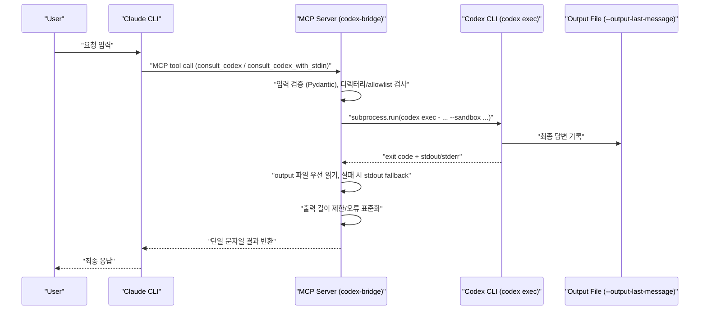

# Codex MCP Bridge Lite

A local stdio MCP server that exposes two tools for Claude CLI and executes `codex exec` non-interactively.

- `consult_codex`
- `consult_codex_with_stdin`

## Features

- Uses `codex exec -` (prompt via stdin) in non-interactive mode.
- Captures final output via `--output-last-message` file first.
- Default sandbox is `read-only`.
- Optional directory allowlist via `CODEX_ALLOWED_DIRS`.
- Output truncation via `CODEX_MAX_OUTPUT_CHARS`.
- Concise error handling for missing CLI/auth/timeout/non-zero exits.
- Keeps MCP stdout clean (no debug logging to stdout).

## Requirements

- Python 3.10+
- Codex CLI installed and authenticated (`codex login`)

## Install

```bash
cd /Users/dante/codex-mcp-bridge
uv venv
source .venv/bin/activate
uv pip install -e .[dev]
```

## Run (stdio MCP)

```bash
cd /Users/dante/codex-mcp-bridge
uv run codex-mcp-bridge
```

## Claude CLI registration example

```bash
claude mcp add codex-bridge -- uv --directory /Users/dante/codex-mcp-bridge run codex-mcp-bridge
```

## Default Launcher Command (Recommended)

Use this launcher to make Claude prefer `codex-bridge` automatically for coding tasks, without writing explicit templates each time.

Launcher script:
- `/Users/dante/codex-mcp-bridge/scripts/claude_codex_launcher.sh`

Run:
```bash
/Users/dante/codex-mcp-bridge/scripts/claude_codex_launcher.sh
```

Optional shell alias:
```bash
alias claude-codex='/Users/dante/codex-mcp-bridge/scripts/claude_codex_launcher.sh'
```

Then use:
```bash
claude-codex
```

Audit launcher (verifies whether Codex bridge tools were actually used):
```bash
/Users/dante/codex-mcp-bridge/scripts/claude_codex_audit.sh "Return exactly BRIDGE_OK"
```

Optional audit alias:
```bash
alias claude-codex-audit='/Users/dante/codex-mcp-bridge/scripts/claude_codex_audit.sh'
```

The audit launcher prints:
- `=== Claude Result ===` final answer text
- `tools_used:` all MCP/tool calls observed
- `codex_bridge_used: yes/no` explicit Codex usage signal
- `codex_bridge_tools:` exact codex-bridge tool names used

Why this launcher is useful:
- Consistent behavior: always injects Codex-first guidance via `--append-system-prompt`.
- Less friction: you do not need to paste tool-call templates for every technical query.
- Fewer permission denials: pre-sets `--allowedTools` for both bridge tools.
- Safer defaults: guidance includes `sandbox=read-only` and `timeout=180` as baseline.

Customizing launcher behavior:
```bash
export CLAUDE_CODEX_APPEND_PROMPT='Your custom codex-first instruction'
export CLAUDE_CODEX_ALLOWED_TOOLS='mcp__codex-bridge__consult_codex,mcp__codex-bridge__consult_codex_with_stdin'
```

Korean quick note:
- 이 런처는 Claude 기본 시스템 프롬프트를 제거하지 않고, Codex 우선 지침을 추가(`append`)합니다.
- 따라서 기본 동작은 유지하면서 Codex 도구 호출 확률을 높이는 방식입니다.

## Quick Guide (EN)

1. Install dependencies and run the bridge server:
```bash
cd /Users/dante/codex-mcp-bridge
uv venv
source .venv/bin/activate
uv pip install -e .[dev]
uv run codex-mcp-bridge
```

2. Register MCP server in Claude CLI:
```bash
claude mcp add codex-bridge -- uv --directory /Users/dante/codex-mcp-bridge run codex-mcp-bridge
```

3. Verify MCP connection:
```bash
claude mcp get codex-bridge
```

4. Verify end-to-end tool calls through Claude:
```bash
cd /Users/dante
claude -p --output-format text --permission-mode dontAsk --allowedTools mcp__codex-bridge__consult_codex -- "Call mcp__codex-bridge__consult_codex with arguments {\"query\":\"Return exactly BRIDGE_OK\",\"directory\":\"/Users/dante/codex-mcp-bridge\",\"format\":\"text\",\"timeout\":180,\"sandbox\":\"read-only\"}. Return only the tool result."
```

```bash
cd /Users/dante
claude -p --output-format text --permission-mode dontAsk --allowedTools mcp__codex-bridge__consult_codex_with_stdin -- "Call mcp__codex-bridge__consult_codex_with_stdin with arguments {\"stdin_content\":\"ping\",\"prompt\":\"Return exactly PONG\",\"directory\":\"/Users/dante/codex-mcp-bridge\",\"format\":\"text\",\"timeout\":180,\"sandbox\":\"read-only\"}. Return only the tool result."
```

5. Troubleshooting:
- `tool denied due to permission restrictions`: add `--allowedTools mcp__codex-bridge__consult_codex` or use a permission mode that allows MCP tools.
- `Codex timed out after 90 seconds`: increase tool `timeout` (e.g. `180`) and keep prompts short/explicit.
- `codex CLI not found`: install Codex CLI and check PATH.
- `Codex authentication appears unavailable`: run `codex login`.

## 빠른 가이드 (KR)

1. 의존성 설치 및 브리지 서버 실행:
```bash
cd /Users/dante/codex-mcp-bridge
uv venv
source .venv/bin/activate
uv pip install -e .[dev]
uv run codex-mcp-bridge
```

2. Claude CLI에 MCP 서버 등록:
```bash
claude mcp add codex-bridge -- uv --directory /Users/dante/codex-mcp-bridge run codex-mcp-bridge
```

3. MCP 연결 상태 확인:
```bash
claude mcp get codex-bridge
```

4. Claude 경유 E2E 도구 호출 검증:
```bash
cd /Users/dante
claude -p --output-format text --permission-mode dontAsk --allowedTools mcp__codex-bridge__consult_codex -- "Call mcp__codex-bridge__consult_codex with arguments {\"query\":\"Return exactly BRIDGE_OK\",\"directory\":\"/Users/dante/codex-mcp-bridge\",\"format\":\"text\",\"timeout\":180,\"sandbox\":\"read-only\"}. Return only the tool result."
```

```bash
cd /Users/dante
claude -p --output-format text --permission-mode dontAsk --allowedTools mcp__codex-bridge__consult_codex_with_stdin -- "Call mcp__codex-bridge__consult_codex_with_stdin with arguments {\"stdin_content\":\"ping\",\"prompt\":\"Return exactly PONG\",\"directory\":\"/Users/dante/codex-mcp-bridge\",\"format\":\"text\",\"timeout\":180,\"sandbox\":\"read-only\"}. Return only the tool result."
```

5. 문제 해결:
- `permission restrictions`로 도구가 거부되면 `--allowedTools`에 해당 MCP 도구를 명시하거나 MCP 허용 모드로 실행합니다.
- `Codex timed out after 90 seconds`가 발생하면 도구 인자의 `timeout`을 늘리고 요청을 짧고 명확하게 작성합니다.
- `codex CLI not found` 오류는 Codex CLI 설치 또는 PATH 설정 문제입니다.
- 인증 오류가 보이면 `codex login`을 먼저 수행합니다.

## Claude Prompt Templates (EN/KR)

Use these templates when you want Claude to invoke Codex via MCP first.

### Template A: Codex-first simple text result (EN)

```text
Call mcp__codex-bridge__consult_codex with arguments {"query":"<YOUR_TASK>","directory":"/Users/dante/codex-mcp-bridge","format":"text","timeout":180,"sandbox":"read-only"}.
Return only the tool result.
```

Example:

```text
Call mcp__codex-bridge__consult_codex with arguments {"query":"Return exactly BRIDGE_OK","directory":"/Users/dante/codex-mcp-bridge","format":"text","timeout":180,"sandbox":"read-only"}.
Return only the tool result.
```

### 템플릿 A: Codex 우선 단순 텍스트 결과 (KR)

```text
mcp__codex-bridge__consult_codex 도구를 다음 인자로 호출해줘: {"query":"<작업 지시문>","directory":"/Users/dante/codex-mcp-bridge","format":"text","timeout":180,"sandbox":"read-only"}.
그리고 도구 결과만 그대로 반환해줘.
```

예시:

```text
mcp__codex-bridge__consult_codex 도구를 다음 인자로 호출해줘: {"query":"정확히 BRIDGE_OK만 반환해","directory":"/Users/dante/codex-mcp-bridge","format":"text","timeout":180,"sandbox":"read-only"}.
그리고 도구 결과만 그대로 반환해줘.
```

### Template B: Structured JSON result (EN)

```text
Call mcp__codex-bridge__consult_codex with arguments {"query":"<YOUR_TASK: return strict JSON>","directory":"/Users/dante/codex-mcp-bridge","format":"json","timeout":180,"sandbox":"read-only"}.
Return only the tool result without markdown fences.
```

### 템플릿 B: 구조화된 JSON 결과 (KR)

```text
mcp__codex-bridge__consult_codex 도구를 다음 인자로 호출해줘: {"query":"<JSON으로 응답해야 하는 작업>","directory":"/Users/dante/codex-mcp-bridge","format":"json","timeout":180,"sandbox":"read-only"}.
마크다운 코드블록 없이 도구 결과만 반환해줘.
```

### Template C: Large input via stdin block (EN)

```text
Call mcp__codex-bridge__consult_codex_with_stdin with arguments {"stdin_content":"<LARGE_INPUT>","prompt":"<TASK_PROMPT>","directory":"/Users/dante/codex-mcp-bridge","format":"json","timeout":180,"sandbox":"read-only"}.
Return only the tool result.
```

### 템플릿 C: 큰 입력 전달 (KR)

```text
mcp__codex-bridge__consult_codex_with_stdin 도구를 다음 인자로 호출해줘: {"stdin_content":"<큰 입력 데이터>","prompt":"<작업 지시문>","directory":"/Users/dante/codex-mcp-bridge","format":"json","timeout":180,"sandbox":"read-only"}.
그리고 도구 결과만 반환해줘.
```

CLI tip (when using `claude -p`):
- If MCP tool calls are denied, include `--allowedTools mcp__codex-bridge__consult_codex` (or `_with_stdin`).
- If timeout occurs, increase `timeout` in tool arguments (e.g. `180` or `240`).

## How It Works (Claude -> Codex CLI Bridge)



핵심 동작 원리:
- Claude는 오케스트레이터 역할만 하고, 코드 생성/분석 실행은 MCP 도구를 통해 Codex CLI에 위임합니다.
- 브리지는 `codex exec`를 비대화식으로 실행하며, stdout 오염을 막기 위해 프로토콜 통신은 stdout, 디버그/오류는 stderr로 분리합니다.
- Codex 결과는 `--output-last-message` 파일에서 우선 읽고, 파일 읽기 실패 시 캡처된 stdout으로 대체합니다.
- 보안/안정성은 기본 `read-only` sandbox, 디렉터리 allowlist, timeout, stderr 절단, output truncation으로 보장합니다.

## Environment variables

- `CODEX_DEFAULT_MODEL` (optional)
- `CODEX_DEFAULT_TIMEOUT` (default: `90`)
- `CODEX_DEFAULT_SANDBOX` (default: `read-only`)
- `CODEX_ALLOWED_DIRS` (optional CSV absolute/relative dirs)
- `CODEX_MAX_OUTPUT_CHARS` (default: `12000`)

Precedence: tool input > environment variable > default.

## Tool Inputs

### `consult_codex`

- `query` (required)
- `directory` (default `.`)
- `format` (`text | json | code`, default from server `json`)
- `timeout` (seconds, optional)
- `model` (optional)
- `sandbox` (`read-only | workspace-write | danger-full-access`, optional)

### `consult_codex_with_stdin`

- `stdin_content` (required)
- `prompt` (required)
- plus all options from `consult_codex`

## Test

```bash
cd /Users/dante/codex-mcp-bridge
uv run pytest
```

## Smoke / Regression Scripts

```bash
cd /Users/dante/codex-mcp-bridge
./scripts/check_stdout_clean.sh
```

```bash
cd /Users/dante/codex-mcp-bridge
./scripts/it_smoke_codex_bridge.sh
```
